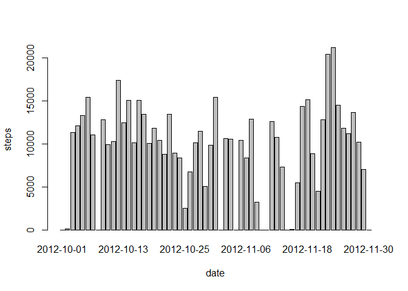
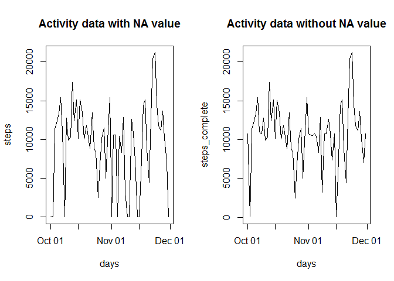
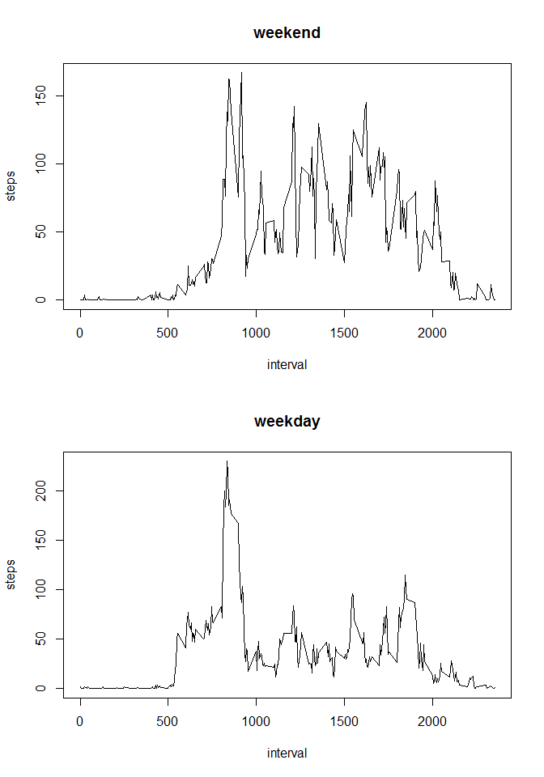

# Reproducible Research: Peer Assessment 1


## > Loading and Preprocessing data


```r
unzip("activity.zip")
activity<-read.csv("activity.csv",colClasses = c("steps"="integer","date"="character","interval"="integer"))
head(activity)
```

```
##   steps       date interval
## 1    NA 2012-10-01        0
## 2    NA 2012-10-01        5
## 3    NA 2012-10-01       10
## 4    NA 2012-10-01       15
## 5    NA 2012-10-01       20
## 6    NA 2012-10-01       25
```

```r
library(lubridate)
```

```
## Warning: package 'lubridate' was built under R version 3.2.5
```

```
## 
## Attaching package: 'lubridate'
```

```
## The following object is masked from 'package:base':
## 
##     date
```

```r
activity$date<-ymd(activity$date)
str(activity)
```

```
## 'data.frame':	17568 obs. of  3 variables:
##  $ steps   : int  NA NA NA NA NA NA NA NA NA NA ...
##  $ date    : Date, format: "2012-10-01" "2012-10-01" ...
##  $ interval: int  0 5 10 15 20 25 30 35 40 45 ...
```

## > Mean total number of steps taken per day


```r
plot_data<-aggregate(activity$steps,by=list(activity$date),sum,na.rm=TRUE)
names(plot_data)<-c("days","steps")
barplot(plot_data$steps, names.arg = plot_data$days, xlab = "date", ylab = "steps")
```

<!-- -->


The mean and median of the total number of steps taken per day.


```r
a<-mean(plot_data$steps)
b<-median(plot_data$steps)
```
mean is 9354.2295082.  
median is 10395.  

## > Average daily activity pattern


```r
plot_data<-aggregate(activity$steps,by=list(activity$interval),mean,na.rm=TRUE)
names(plot_data)<-c("interval","steps_avg")
library(ggplot2)
ggplot(data=plot_data,aes(x=interval,y=steps_avg))+geom_line()+xlab("interval")+ylab("steps")
```

<!-- -->

Which 5-minute interval, on average across all the days in the dataset, contains the maximum number of steps?


```r
plot_data$interval[which.max(plot_data$steps)]
```

```
## [1] 835
```

## > Imputing missing values

Total number of missing values in the dataset (i.e. the total number of rows with NAs)


```r
sum(is.na(activity))
```

```
## [1] 2304
```

Filling in all of the missing values in the dataset


```r
plot_data<-aggregate(activity$steps,by=list(activity$interval),mean,na.rm=TRUE)
names(plot_data)<-c("interval","steps")
activity_raw<-data.frame()
activity_raw<-activity
activity <- merge(activity, plot_data, by = "interval", suffixes = c("", 
    ".y"))
missings<-is.na(activity$steps)
activity$steps[missings] <- activity$steps.y[missings]
activity <- activity[, c(1:3)]
```

Histogram of the total number of steps taken each day


```r
plot_data<-aggregate(activity$steps,by=list(activity$date),sum,na.rm=TRUE)
names(plot_data)<-c("days","steps")
barplot(plot_data$steps, names.arg = plot_data$days, xlab = "date", ylab = "steps")
```

<!-- -->

Calculate and report the mean and median total number of steps taken per day


```r
mean(plot_data$steps)
```

```
## [1] 10766.19
```

```r
median(plot_data$steps)
```

```
## [1] 10766.19
```


Do these values differ from the estimates from the first part of the assignment?


```r
plot_data0<-aggregate(activity_raw$steps,by=list(activity_raw$date),sum,na.rm=TRUE)
names(plot_data0)<-c("days","steps")
plot_data0$steps_complete<-plot_data$steps
head(plot_data0)
```

```
##         days steps steps_complete
## 1 2012-10-01     0       10766.19
## 2 2012-10-02   126         126.00
## 3 2012-10-03 11352       11352.00
## 4 2012-10-04 12116       12116.00
## 5 2012-10-05 13294       13294.00
## 6 2012-10-06 15420       15420.00
```

What is the impact of imputing missing data on the estimates of the total daily number of steps?


```r
par(mfrow = c(1, 2))
with(plot_data0, {
plot(days, steps, type="l",main = "Activity data with NA value")
plot(days, steps_complete, type="l", main = "Activity data without NA value")
})
```

<!-- -->

## > Differences in activity patterns between weekdays and weekends

Create a new factor variable in the dataset with two levels - "weekday" and "weekend" indicating whether a given date is a weekday or weekend day.


```r
daytype <- function(date) {
    if (weekdays(date) %in% c("Saturday", "Sunday")) {
        "weekend"
    } else {
        "weekday"
    }
}
activity$daytype <- as.factor(sapply(activity$date, daytype))
```

Make a panel plot containing a time series plot (i.e. type = "l") of the 5-minute interval (x-axis) and the average number of steps taken, averaged across all weekday days or weekend days (y-axis).


```r
par(mfrow = c(2, 1))
for (type in c("weekend", "weekday")) {
    plot_data <- aggregate(steps ~ interval, data = activity, subset = activity$daytype == 
        type, FUN = mean)
    plot(plot_data, type = "l", main = type)
}
```

<!-- -->
